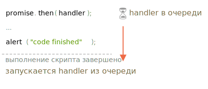

# Микрозадачи

Обработчики промисов `.then`/`.catch`/`.finally` всегда асинхронны.

Даже когда промис сразу же выполнен, код в строках *ниже* `.then`/`.catch`/`.finally` будет запущен до этих обработчиков.

Вот демо:

```js run
let promise = Promise.resolve();

promise.then(() => alert("промис выполнен"));

alert("код выполнен"); // этот alert показывается первым
```

Если вы запустите его, сначала вы  увидите `код выполнен`, а потом `промис выполнен`.

Это странно, потому что промис определённо был выполнен с самого начала.

Почему `.then` срабатывает позже? Что происходит?

## Очередь микрозадач

Асинхронные задачи требуют правильного управления. Для этого стандарт предусматривает внутреннюю очередь `PromiseJobs`, более известную как "очередь микрозадач (microtask queue)" (термин V8).

Как сказано в [спецификации](https://tc39.github.io/ecma262/#sec-jobs-and-job-queues):

- Очередь определяется как первым-пришёл-первым-ушёл (FIFO): задачи, попавшие в очередь первыми, выполняются тоже первыми.
- Выполнение задачи происходит только в том случае, если ничего больше не запущено.

<<<<<<< HEAD
Или, проще говоря, когда промис выполнен, его обработчики `.then/catch/finally` попадают в очередь. Они пока не выполняются. Движок JavaScript берёт задачу из очереди и выполняет её, когда он освободится от выполнения текущего кода.
=======
Or, to say that simply, when a promise is ready, its `.then/catch/finally` handlers are put into the queue. They are not executed yet. When the JavaScript engine becomes free from the current code, it takes a task from the queue and executes it.
>>>>>>> e92bb83e995dfea982dcdc5065036646bfca13f0

Вот почему сообщение "код выполнен" в примере выше будет показано первым.



<<<<<<< HEAD
Обработчики промисов всегда проходят через эту внутреннюю очередь.
=======
Promise handlers always go through this internal queue.
>>>>>>> e92bb83e995dfea982dcdc5065036646bfca13f0

Если есть цепочка с несколькими `.then/catch/finally`, то каждый из них выполняется асинхронно. То есть сначала ставится в очередь, а потом выполняется, когда выполнение текущего кода завершено и добавленные ранее в очередь обработчики выполнены.

<<<<<<< HEAD
**Но что если порядок имеет значение для нас? Как мы можем вывести `код выполнен` после `промис выполнен`?**
=======
**What if the order matters for us? How can we make `code finished` run after `promise done`?**
>>>>>>> e92bb83e995dfea982dcdc5065036646bfca13f0

Легко, используя `.then`:

```js run
Promise.resolve()
  .then(() => alert("промис выполнен!"))
  .then(() => alert("код выполнен"));
```

Теперь порядок стал таким, как было задумано.

## Необработанные ошибки

<<<<<<< HEAD
Помните "необработанные ошибки" из главы <info:promise-error-handling>?

Теперь мы можем описать, как именно JavaScript понимает, что ошибка не обработана.
=======
Remember the `unhandledrejection` event from the chapter <info:promise-error-handling>?

Now we can see exactly how JavaScript finds out that there was an unhandled rejection.
>>>>>>> e92bb83e995dfea982dcdc5065036646bfca13f0

**"Необработанная ошибка" возникает в случае, если ошибка промиса не обрабатывается в конце очереди микрозадач.**

Обычно, если мы ожидаем ошибку, мы добавляем `.catch` в конец цепочки промисов, чтобы обработать её:

```js run
let promise = Promise.reject(new Error("Ошибка в промисе!"));
*!*
promise.catch(err => alert('поймана!'));
*/!*

// не запустится, ошибка обработана
window.addEventListener('unhandledrejection', event => {
  alert(event.reason);
});
```

...Но если мы забудем добавить `.catch`, то, когда очередь микрозадач опустеет, движок сгенерирует событие:


```js run
let promise = Promise.reject(new Error("Ошибка в промисе!"));

// Ошибка в промисе!
window.addEventListener('unhandledrejection', event => alert(event.reason));
```

А что, если мы поймаем ошибку, но позже? Вот так:

```js run
let promise = Promise.reject(new Error("Ошибка в промисе!"));

*!*
setTimeout(() => promise.catch(err => alert('поймана')), 1000);
*/!*

// Ошибка в промисе!
window.addEventListener('unhandledrejection', event => alert(event.reason));
```

<<<<<<< HEAD
Теперь, при запуске, мы сначала увидим "Ошибка в промисе!", а затем "поймана".

Если бы мы не знали про очередь микрозадач, то могли бы удивиться: "Почему сработал обработчик `unhandledrejection`? Мы же поймали ошибку!".
=======
Now, if you run it, we'll see `Promise Failed!` first and then `caught`. 

If we didn't know about the microtasks queue, we could wonder: "Why did `unhandledrejection` handler run? We did catch the error!".
>>>>>>> e92bb83e995dfea982dcdc5065036646bfca13f0

Но теперь мы понимаем, что событие `unhandledrejection` возникает, когда очередь микрозадач завершена: движок проверяет все промисы и, если какой-либо из них в состоянии "rejected", то генерируется это событие.

В примере выше `.catch`, добавленный в `setTimeout`, также срабатывает, но позже, уже после возникновения `unhandledrejection`, так что это ни на что не влияет.

## Итого

Обработка промисов всегда асинхронная, т.к. все действия промисов проходят через внутреннюю очередь "promise jobs", так называемую "очередь микрозадач (microtask queue)" (термин v8).

Таким образом, обработчики `.then/catch/finally` вызываются после выполнения текущего кода.

Если нам нужно гарантировать выполнение какого-то кода после `.then/catch/finally`, то лучше всего добавить его вызов в цепочку `.then`.

В большинстве движков JavaScript, включая браузеры и Node.js, микрозадачи тесно связаны с так называемым "событийным циклом" и "макрозадачами". Так как они не связаны напрямую с промисами, то рассматриваются в другой части учебника, в главе <info:event-loop>.
