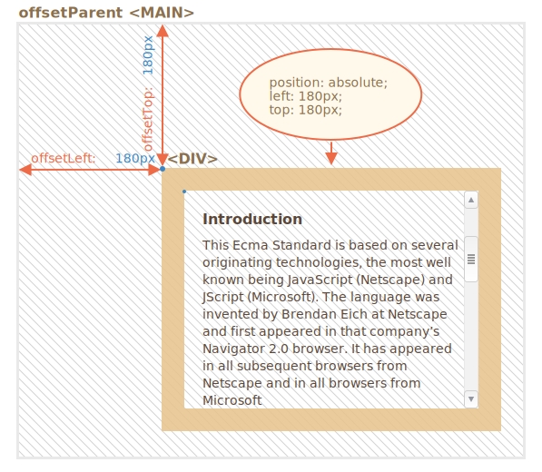
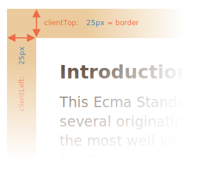
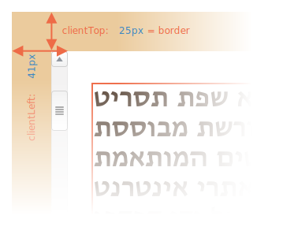
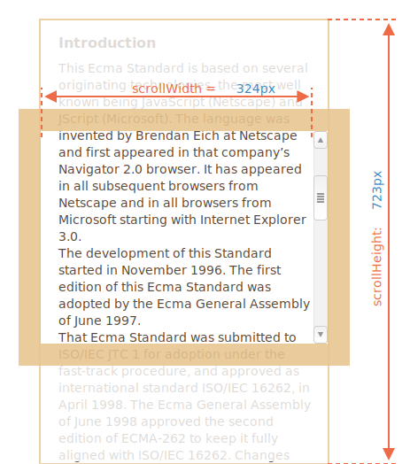
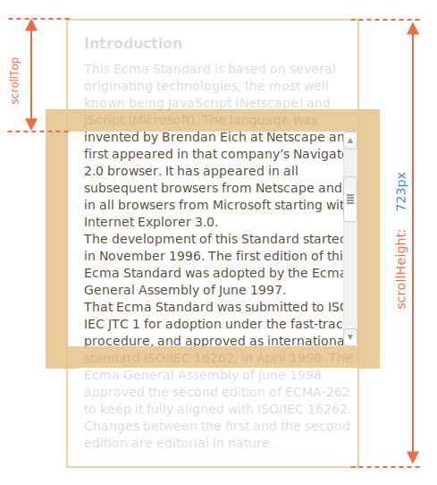

# Размеры и прокрутка элементов

Существует множество JavaScript-свойств, которые позволяют считывать информацию об элементе: ширину, высоту и другие геометрические характеристики. В этой главе мы будем называть их "метрики".

Они часто требуются, когда нам нужно передвигать или позиционировать элементы с помощью JavaScript.

## Простой пример

В качестве простого примера демонстрации свойств мы будем использовать следующий элемент:

```html no-beautify
<div id="example">
  ...Текст...
</div>
<style>
  #example {
    width: 300px;
    height: 200px;
    border: 25px solid #E8C48F;
    padding: 20px;
    overflow: auto;
  }
</style>
```

У элемента есть рамка (border), внутренний отступ (padding) и прокрутка. Полный набор характеристик. Обратите внимание, тут нет внешних отступов (margin), потому что они не являются частью элемента, для них нет особых JavaScript-свойств.

Результат выглядит так:


Вы можете [открыть этот пример в песочнице](sandbox:metric).

```smart header="Внимание, полоса прокрутки"
В иллюстрации выше намеренно продемонстрирован самый сложный и полный случай, когда у элемента есть ещё и полоса прокрутки. Некоторые браузеры (не все) отбирают место для неё, забирая его у области, отведённой для содержимого (помечена как "content width" выше).

Таким образом, без учёта полосы прокрутки ширина области содержимого (content width) будет `300px`, но если предположить, что ширина полосы прокрутки равна `16px` (её точное значение зависит от устройства и браузера), тогда остаётся только `300 - 16 = 284px`, и мы должны это учитывать. Вот почему примеры в этой главе даны с полосой прокрутки. Без неё некоторые вычисления будут проще.
```

```smart header="Область `padding-bottom` (нижний внутренний отступ) может быть заполнена текстом"
Нижние внутренние отступы `padding-bottom` изображены пустыми на наших иллюстрациях, но если элемент содержит много текста, то он будет перекрывать `padding-bottom`, это нормально.
```

## Метрики

Вот общая картина с геометрическими свойствами:


Значениями свойств являются числа, подразумевается, что они в пикселях.

Давайте начнём исследовать, начиная снаружи элемента.

## offsetParent, offsetLeft/Top

Эти свойства редко используются, но так как они являются "самыми внешними" метриками, мы начнём с них.

<<<<<<< HEAD
В свойстве `offsetParent` находится предок элемента, который используется внутри браузера для вычисления координат при рендеринге.

То есть, ближайший предок, который удовлетворяет следующим условиям:

1. Является CSS-позиционированным (CSS-свойство `position` равно `absolute`, `relative`, `fixed` или `sticky`),
2. или `<td>`, `<th>`, `<table>`,
3. или `<body>`.
=======
The `offsetParent` is the nearest ancestor that the browser uses for calculating coordinates during rendering.

That's the nearest ancestor that is one of the following:

1. CSS-positioned (`position` is `absolute`, `relative`, `fixed` or `sticky`),  or
2. `<td>`, `<th>`, or `<table>`,  or
3. `<body>`.
>>>>>>> 14e4e9f96bcc2bddc507f409eb4716ced897f91a

Свойства `offsetLeft/offsetTop` содержат координаты x/y относительно верхнего левого угла `offsetParent`.

В примере ниже внутренний `<div>` имеет элемент `<main>` в качестве `offsetParent`, а свойства `offsetLeft/offsetTop` являются сдвигами относительно верхнего левого угла (`180`):

```html run height=10
<main style="position: relative" id="main">
  <article>
    <div id="example" style="position: absolute; left: 180px; top: 180px">...</div>
  </article>
</main>
<script>
  alert(example.offsetParent.id); // main
  alert(example.offsetLeft); // 180 (обратите внимание: число, а не строка "180px")
  alert(example.offsetTop); // 180
</script>
```



Существует несколько ситуаций, когда `offsetParent` равно `null`:

1. Для скрытых элементов (с CSS-свойством `display:none` или когда его нет в документе).
2. Для элементов `<body>` и `<html>`.
3. Для элементов с `position:fixed`.

## offsetWidth/Height

Теперь переходим к самому элементу.

Эти два свойства – самые простые. Они содержат "внешнюю" ширину/высоту элемента, то есть его полный размер, включая рамки.


Для нашего элемента:

- `offsetWidth = 390` -- внешняя ширина блока, её можно получить сложением CSS-ширины (`300px`), внутренних отступов (`2 * 20px`) и рамок (`2 * 25px`).
- `offsetHeight = 290` -- внешняя высота блока.

````smart header="Метрики для не показываемых элементов равны нулю."
Координаты и размеры в JavaScript устанавливаются только для видимых элементов.

<<<<<<< HEAD
Если элемент (или любой его родитель) имеет `display:none` или отсутствует в документе, то все его метрики равны нулю (или `null`, если это `offsetParent`).
=======
If an element (or any of its ancestors) has `display:none` or is not in the document, then all geometry properties are zero (or `null` for `offsetParent`).
>>>>>>> 14e4e9f96bcc2bddc507f409eb4716ced897f91a

Например, свойство `offsetParent` равно `null`, а `offsetWidth` и `offsetHeight` равны `0`, когда мы создали элемент, но ещё не вставили его в документ, или если у элемента (или у его родителя) `display:none`.

Мы можем использовать это, чтобы делать проверку на видимость:

```js
function isHidden(elem) {
  return !elem.offsetWidth && !elem.offsetHeight;
}
```

Заметим, что функция `isHidden` также вернёт `true` для элементов, которые в принципе показываются, но их размеры равны нулю (например, пустые `<div>`).
````

## clientTop/Left

Пойдём дальше. Внутри элемента у нас рамки (border).

Для них есть свойства-метрики `clientTop` и `clientLeft`.

В нашем примере:

- `clientLeft = 25` -- ширина левой рамки
- `clientTop = 25` -- ширина верхней рамки



...Но на самом деле эти свойства - вовсе не ширины рамок, а отступы внутренней части элемента от внешней.

В чём же разница?

Она возникает, когда документ располагается справа налево (операционная система на арабском языке или иврите). Полоса прокрутки в этом случае находится слева, и тогда свойство `clientLeft` включает в себя ещё и ширину полосы прокрутки.

В этом случае `clientLeft` будет равно `25`, но с прокруткой -- `25 + 16 = 41`.

Вот соответствующий пример на иврите:



## clientWidth/Height

Эти свойства -- размер области внутри рамок элемента.

Они включают в себя ширину области содержимого вместе с внутренними отступами `padding`, но без прокрутки:


На рисунке выше посмотрим вначале на высоту `clientHeight`.

Горизонтальной прокрутки нет, так что это в точности то, что внутри рамок: CSS-высота `200px` плюс верхние и нижние внутренние отступы (`2 * 20px`), итого `240px`.

Теперь `clientWidth` -- ширина содержимого здесь равна не `300px`, а `284px`, т.к. `16px` отведено для полосы прокрутки. Таким образом: `284px` плюс левый и правый отступы -- всего `324px`.

**Если нет внутренних отступов `padding`, то `clientWidth/Height` в точности равны размеру области содержимого внутри рамок и полосы прокрутки (если она есть).**


Поэтому в тех случаях, когда мы точно знаем, что отступов нет, можно использовать `clientWidth/clientHeight` для получения размеров внутренней области содержимого.

## scrollWidth/Height

Эти свойства - как `clientWidth/clientHeight`, но также включают в себя прокрученную (которую не видно) часть элемента.



На рисунке выше:

- `scrollHeight = 723` -- полная внутренняя высота, включая прокрученную область.
- `scrollWidth = 324` -- полная внутренняя ширина, в данном случае прокрутки нет, поэтому она равна `clientWidth`.

Эти свойства можно использовать, чтобы "распахнуть" элемент на всю ширину/высоту.

Таким кодом:

```js
// распахнуть элемент на всю высоту
element.style.height = `${element.scrollHeight}px`;
```

```online
Нажмите на кнопку, чтобы распахнуть элемент:

<div id="element" style="width:300px;height:200px; padding: 0;overflow: auto; border:1px solid black;">текст текст текст текст текст текст текст текст текст текст текст текст текст текст текст текст текст текст текст текст текст текст текст текст текст текст текст текст текст текст текст текст текст текст текст текст текст текст текст текст текст текст текст текст текст текст текст текст текст текст текст текст текст текст текст текст текст текст текст текст текст текст текст текст текст текст текст текст текст текст текст текст текст текст текст текст текст текст текст текст текст текст текст текст текст текст текст текст текст текст текст текст текст текст текст текст текст текст текст текст текст текст текст текст текст текст текст текст текст текст текст текст текст текст текст текст текст текст текст текст текст текст текст текст текст текст текст текст текст текст текст текст текст текст текст текст текст текст текст текст</div>

<button style="padding:0" onclick="element.style.height = `${element.scrollHeight}px`">element.style.height = `${element.scrollHeight}px`</button>
```

## scrollLeft/scrollTop

Свойства `scrollLeft/scrollTop` -- ширина/высота невидимой, прокрученной в данный момент, части элемента слева и сверху.

Следующая иллюстрация показывает значения `scrollHeight` и `scrollTop` для блока с вертикальной прокруткой.



Другими словами, свойство `scrollTop` -- это "сколько уже прокручено вверх".

````smart header="`Свойства scrollLeft/scrollTop` можно изменять"
В отличие от большинства свойств, которые доступны только для чтения, значения `scrollLeft/scrollTop` можно изменять, и браузер выполнит прокрутку элемента..

```online
При клике на следующий элемент будет выполняться код  `elem.scrollTop += 10`. Поэтому он будет прокручиваться на `10px` вниз.

<div onclick="this.scrollTop+=10" style="cursor:pointer;border:1px solid black;width:100px;height:80px;overflow:auto">Кликни<br>Меня<br>1<br>2<br>3<br>4<br>5<br>6<br>7<br>8<br>9</div>
```

Установка значения `scrollTop` на `0` или `Infinity` прокрутит элемент в самый верх/низ соответственно.
````

## Не стоит брать width/height из CSS

Мы рассмотрели метрики, которые есть у DOM-элементов, и которые можно использовать для получения различных высот, ширин и прочих расстояний.

Но как мы знаем из главы <info:styles-and-classes>, CSS-высоту и ширину можно извлечь, используя `getComputedStyle`.

Так почему бы не получать, к примеру, ширину элемента при помощи `getComputedStyle`, вот так?

```js run
let elem = document.body;

alert( getComputedStyle(elem).width ); // показывает CSS-ширину elem
```

Почему мы должны использовать свойства-метрики вместо этого? На то есть две причины:

1. Во-первых, CSS-свойства `width/height` зависят от другого свойства -- `box-sizing`, которое определяет, "что такое", собственно, эти CSS-ширина и высота. Получается, что изменение `box-sizing`, к примеру, для более удобной вёрстки, сломает такой JavaScript.
2. Во-вторых, в CSS свойства `width/height` могут быть равны `auto`, например, для инлайнового элемента:

    ```html run
    <span id="elem">Привет!</span>

    <script>
    *!*
      alert( getComputedStyle(elem).width ); // auto
    */!*
    </script>
    ```

<<<<<<< HEAD
    Конечно, с точки зрения CSS `width:auto` – совершенно нормально, но нам-то в JavaScript нужен конкретный размер в `px`, который мы могли бы использовать для вычислений. Получается, что в данном случае ширина из CSS вообще бесполезна.

Есть и ещё одна причина: полоса прокрутки. Бывает, без полосы прокрутки код работает прекрасно, но стоит ей появиться, как начинают проявляться баги. Так происходит потому, что полоса прокрутки "отъедает" место от области внутреннего содержимого в некоторых браузерах. Таким образом, реальная ширина содержимого *меньше* CSS-ширины. Как раз это и учитывают свойства `clientWidth/clientHeight`.
=======
    From the CSS standpoint, `width:auto` is perfectly normal, but in JavaScript we need an exact size in `px` that we can use in calculations. So here CSS width is useless.

And there's one more reason: a scrollbar. Sometimes the code that works fine without a scrollbar becomes buggy with it, because a scrollbar takes the space from the content in some browsers. So the real width available for the content is *less* than CSS width. And `clientWidth/clientHeight` take that into account.
>>>>>>> 14e4e9f96bcc2bddc507f409eb4716ced897f91a

...Но с `getComputedStyle(elem).width` ситуация иная. Некоторые браузеры (например, Chrome) возвращают реальную внутреннюю ширину с вычетом ширины полосы прокрутки, а некоторые (например, Firefox) -- именно CSS-свойство (игнорируя полосу прокрутки). Эти кроссбраузерные отличия – ещё один повод не использовать `getComputedStyle`, а использовать свойства-метрики.

```online
Если ваш браузер показывает полосу прокрутки (например, под Windows почти все браузеры так делают), то вы можете протестировать это сами, нажав на кнопку в ифрейме ниже.

[iframe src="cssWidthScroll" link border=1]

У элемента с текстом в стилях указано CSS-свойство `width:300px`.

На ОС Windows браузеры Firefox, Chrome и Edge резервируют место для полосы прокрутки. Но Firefox отображает `300px`, в то время как Chrome и Edge -- меньше. Это из-за того, что Firefox возвращает именно CSS-ширину, а остальные браузеры -- "реальную" ширину за вычетом прокрутки.
```

Обратите внимание: описанные различия касаются только чтения свойства `getComputedStyle(...).width` из JavaScript, визуальное отображение корректно в обоих случаях.

## Итого

У элементов есть следующие геометрические свойства (метрики):

<<<<<<< HEAD
- `offsetParent` -- ближайший CSS-позиционированный родитель или ближайший `td`, `th`, `table`, `body`.
- `offsetLeft/offsetTop` -- позиция в пикселях верхнего левого угла относительно `offsetParent`.
- `offsetWidth/offsetHeight` -- "внешняя" ширина/высота элемента, включая рамки.
- `clientLeft/clientTop` -- расстояние от верхнего левого внешнего угла до внутренного. Для операционных систем с ориентацией слева-направо эти свойства равны ширинам левой/верхней рамки. Если язык ОС таков, что ориентация справа налево, так что вертикальная полоса прокрутки находится не справа, а слева, то `clientLeft` включает в своё значение её ширину.
- `clientWidth/clientHeight` -- ширина/высота содержимого вместе с внутренними отступами `padding`, но без полосы прокрутки.
- `scrollWidth/scrollHeight` -- ширины/высота содержимого, аналогично `clientWidth/Height`, но учитывают прокрученную, невидимую область элемента.
- `scrollLeft/scrollTop` -- ширина/высота прокрученной сверху части элемента, считается от верхнего левого угла.
=======
- `offsetParent` -- is the nearest positioned ancestor or `td`, `th`, `table`, `body`.
- `offsetLeft/offsetTop` -- coordinates relative to the upper-left edge of `offsetParent`.
- `offsetWidth/offsetHeight` -- "outer" width/height of an element including borders.
- `clientLeft/clientTop` -- the distances from the upper-left outer corner to the upper-left inner (content + padding) corner. For left-to-right OS they are always the widths of left/top borders. For right-to-left OS the vertical scrollbar is on the left so `clientLeft` includes its width too.
- `clientWidth/clientHeight` -- the width/height of the content including paddings, but without the scrollbar.
- `scrollWidth/scrollHeight` -- the width/height of the content, just like `clientWidth/clientHeight`, but also include scrolled-out, invisible part of the element.
- `scrollLeft/scrollTop` -- width/height of the scrolled out upper part of the element, starting from its upper-left corner.
>>>>>>> 14e4e9f96bcc2bddc507f409eb4716ced897f91a

Все свойства доступны только для чтения, кроме `scrollLeft/scrollTop`, изменение которых заставляет браузер прокручивать элемент.
